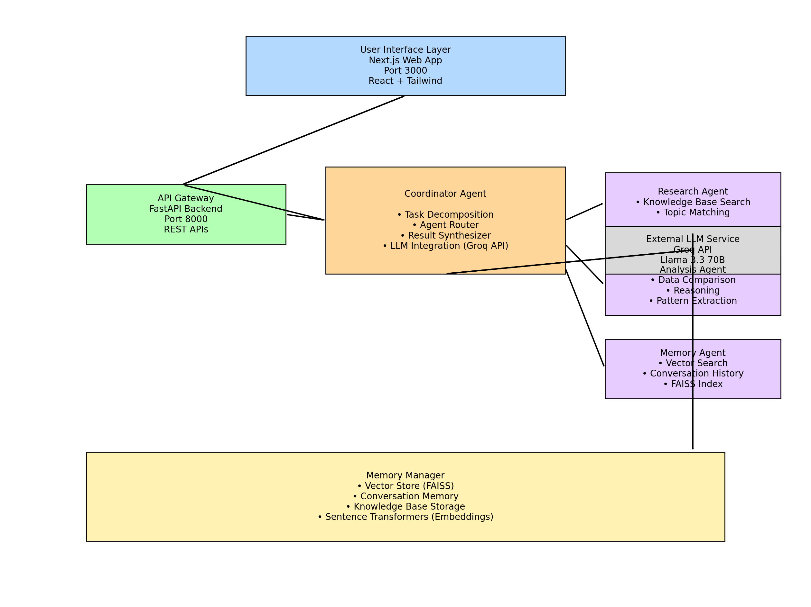

# Multi-Agent Chat System: One-Pager Abstract
## Knowledge Representation and Reasoning Assignment

---

## What is the System?

The **Multi-Agent Chat System** is an intelligent question-answering platform that employs a coordinated multi-agent architecture to process and respond to user queries. The system consists of four specialized AI agents working together under the orchestration of a Coordinator Agent:

- **Coordinator Agent (Manager)**: Orchestrates task decomposition, routes queries to appropriate agents, and synthesizes final responses
- **Research Agent**: Retrieves relevant information from a pre-loaded knowledge base covering AI, machine learning, neural networks, and related topics
- **Analysis Agent**: Performs comparative analysis, reasoning, and extracts insights from research data
- **Memory Agent**: Manages long-term conversation memory using vector search (FAISS) for semantic retrieval of past conversations

The system integrates with Groq's LLM API (Llama 3.3 70B) for intelligent task decomposition and summarization, with rule-based fallbacks ensuring reliability. It features a modern web interface (Next.js) and RESTful API (FastAPI) for seamless user interaction.

---

## How Does It Work?

### System Architecture Flow

1. **Query Reception**: User submits a query through the web interface or API

2. **Task Decomposition**: Coordinator Agent analyzes the query complexity and determines which agents are needed:
   - **Simple queries** (e.g., "hello") → Direct response
   - **Research queries** → Research Agent retrieves relevant knowledge
   - **Analytical queries** → Analysis Agent processes and compares data
   - **Memory queries** (e.g., "What did we learn earlier?") → Memory Agent searches conversation history

3. **Agent Execution**: Specialized agents execute their tasks in parallel or sequence:
   - Research Agent searches knowledge base using keyword and semantic matching
   - Analysis Agent performs comparisons, extracts implications, and identifies patterns
   - Memory Agent uses vector embeddings (sentence-transformers) to find semantically similar past conversations

4. **Result Synthesis**: Coordinator Agent combines agent outputs, applies LLM summarization (or rule-based synthesis), and generates a coherent final answer

5. **Memory Storage**: Relevant findings are stored in the vector database for future retrieval

### Key Technologies

- **Backend**: Python 3.12+, FastAPI, FAISS vector database
- **Frontend**: Next.js, React, Tailwind CSS
- **LLM Integration**: Groq API (Llama 3.3 70B Versatile)
- **Vector Search**: Sentence Transformers + FAISS for semantic similarity
- **Containerization**: Docker & Docker Compose

### Knowledge Representation

- **Structured Knowledge Base**: Pre-loaded topics including AI fundamentals, neural networks, optimization techniques, privacy implications, and more
- **Conversation Memory**: Vector embeddings of past conversations stored with metadata (topic, confidence, source agent)
- **Agent State Memory**: Tracks task IDs and agent interactions for traceability

---

## System Design Diagram

### Component Interactions

1. **User → Coordinator**: Query received and task plan created
2. **Coordinator → Research Agent**: Knowledge base search request
3. **Coordinator → Analysis Agent**: Data analysis request with research results
4. **Coordinator → Memory Agent**: Memory search/store operations
5. **Agents → Memory Manager**: Store findings and retrieve past conversations
6. **Coordinator → LLM Client**: Optional LLM-based decomposition/summarization
7. **Coordinator → User**: Synthesized final answer

---

## Key Features

✅ **Multi-Agent Coordination**: Intelligent task routing and parallel execution  
✅ **Vector-Based Memory**: Semantic search of conversation history  
✅ **LLM Integration**: Groq API with rule-based fallbacks  
✅ **Structured Knowledge**: Pre-loaded knowledge base with 8+ topic categories  
✅ **Adaptive Decision-Making**: Complexity-based agent selection  
✅ **Traceable Outputs**: Detailed logging of agent interactions  
✅ **Modern UI**: Responsive web interface with real-time chat  
✅ **Docker Support**: Containerized deployment for consistency

---

## Technical Highlights

- **Knowledge Representation**: Hierarchical topic-based knowledge structure with confidence scoring
- **Reasoning**: Multi-step analysis with agent collaboration
- **Memory Retrieval**: FAISS-powered semantic similarity search (cosine similarity)
- **Error Handling**: Graceful fallbacks when LLM unavailable
- **Scalability**: Modular architecture supporting additional agents

---

**System Status**: Fully functional with all 4 agents implemented, vector memory system operational, and web interface deployed.

**Deployment**: Available via Docker Compose or standalone Python/Node.js setup.

