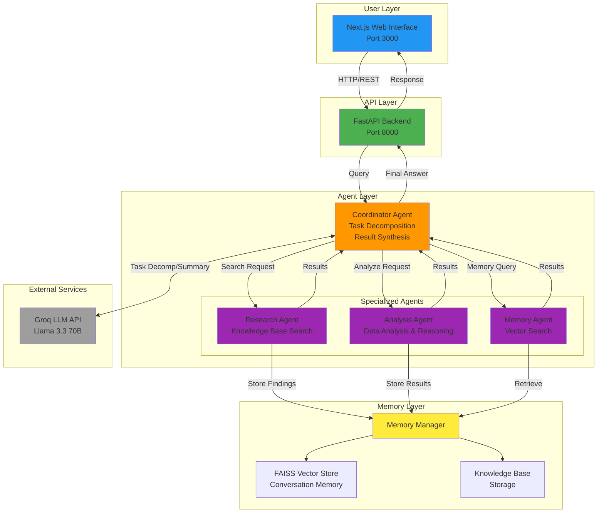

# System Diagram - Text Description for AI Diagram Generation

Use this description with ChatGPT, Figma, or any diagramming tool to generate the visual system diagram.

## Prompt for AI Diagram Generation:

"Create a system architecture diagram for a Multi-Agent Chat System with the following components and flow:

### Components:

1. **User Interface Layer** (Top)
   - Next.js Web Application
   - Port 3000
   - React components with Tailwind CSS

2. **API Gateway Layer** (Middle)
   - FastAPI Backend Server
   - Port 8000
   - RESTful API endpoints

3. **Coordinator Agent** (Central Orchestrator)
   - Task Decomposition Module
   - Agent Router
   - Result Synthesizer
   - LLM Integration (Groq API)

4. **Specialized Agents** (Three parallel agents):
   - **Research Agent**: Knowledge Base Search, Topic Matching
   - **Analysis Agent**: Data Comparison, Reasoning, Pattern Extraction
   - **Memory Agent**: Vector Search, Conversation History, FAISS Index

5. **Memory Manager** (Bottom Layer)
   - Vector Store (FAISS)
   - Conversation Memory
   - Knowledge Base Storage
   - Sentence Transformers for Embeddings

6. **External Services**
   - Groq LLM API (Llama 3.3 70B)

### Data Flow:

1. User sends query → User Interface
2. User Interface → FastAPI Backend (HTTP Request)
3. FastAPI → Coordinator Agent
4. Coordinator Agent:
   - Decomposes task
   - Routes to Research/Analysis/Memory agents (parallel or sequential)
   - Agents execute and return results
5. Agents interact with Memory Manager for storage/retrieval
6. Coordinator synthesizes results (optionally using LLM)
7. Coordinator → FastAPI → User Interface → User

### Visual Style:
- Use boxes for components
- Use arrows for data flow
- Color code: User Interface (Blue), API (Green), Coordinator (Orange), Agents (Purple), Memory (Yellow), External (Gray)
- Show bidirectional arrows where applicable
- Group related components

### Layout:
- Top: User Interface
- Middle-Left: FastAPI Backend
- Middle-Center: Coordinator Agent (larger, central)
- Middle-Right: Three specialized agents (stacked vertically)
- Bottom: Memory Manager (spans width)
- Right side: External LLM API

Please create a professional system architecture diagram with clear labels and connections."

## Alternative: Mermaid Diagram Code

You can also use this Mermaid code in tools like Mermaid Live Editor (https://mermaid.live) or GitHub:

## Tools for Creating Diagrams:

1. **Figma** (Recommended): https://www.figma.com
   - Free account available
   - Professional diagrams
   - Can link to ChatGPT for AI generation

2. **Draw.io (diagrams.net)**: https://app.diagrams.net
   - Free, no account needed
   - Export to PDF/PNG
   - Many templates

3. **Mermaid Live Editor**: https://mermaid.live
   - Free, code-based diagrams
   - Export as PNG/SVG

4. **Lucidchart**: https://www.lucidchart.com
   - Free tier available
   - Professional templates

5. **ChatGPT with Diagram Generation**:
   - Use the prompt above
   - Can generate Mermaid code or describe layout
   - Can link to Figma if you have ChatGPT Plus

6. **Excalidraw**: https://excalidraw.com
   - Free, hand-drawn style
   - Collaborative

## Recommended Approach:

1. **Quick Option**: Use Mermaid code above in https://mermaid.live → Export as PNG → Insert in PDF
2. **Professional Option**: Use the text prompt with ChatGPT → Generate diagram → Export
3. **Custom Option**: Use Draw.io with the component list above to create your own

